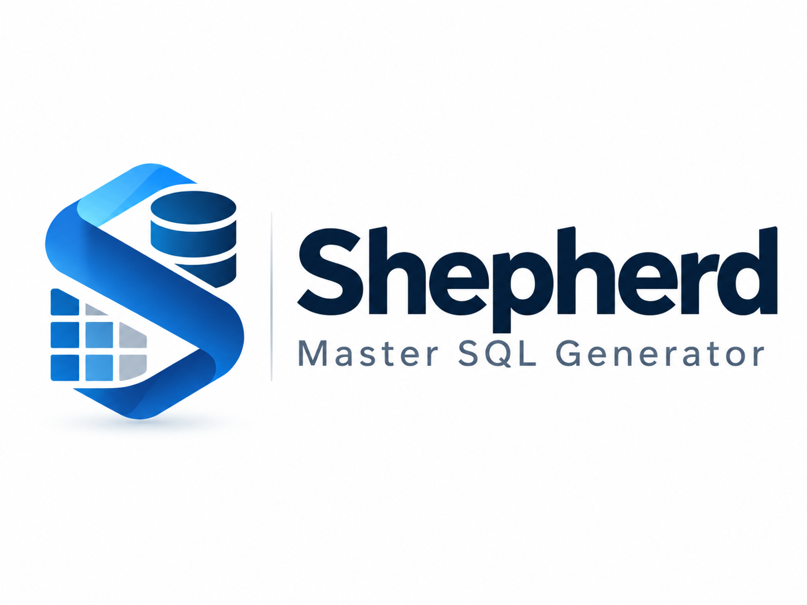

# Shepherd Master SQL Generator



Windows 10/11 向けのローカルデスクトップアプリです。確定済みの Shepherd マスタ整備 Excel、テーブル定義書、部門マスタ、区分名称マスタを読み込み、全件検証後に MySQL INSERT SQL を生成・確認・保存します。元のファイルは変更しません。DB接続、SQL実行、認証、外部アップロードはありません。

## 必要な環境

- Windows 10 / 11、x64
- Node.js 22.12 以上（検証環境: 22.23.3）、npm
- Rust stable、`x86_64-pc-windows-msvc`
- Visual Studio Build Tools の **C++ によるデスクトップ開発**、MSVC と Windows SDK
- Microsoft Edge WebView2 Runtime

依存パッケージの取得・初回ビルドにはインターネットが必要です。アプリの通常利用はオフラインです。WebView2 がない PC ではインストーラーが取得を試みるため、完全オフライン配布では WebView2 を事前に用意してください。生成インストーラーは組織の署名証明書を設定しない限り未署名です。

## 開発

```powershell
npm install
npm run desktop:dev
```

ブラウザで画面とローカル処理を確認する場合:

```powershell
npm run dev
```

ブラウザ版はファイル内容をそのブラウザ内で処理します。完全パス、ネイティブダイアログ、Explorer、SQLite はデスクトップ版の機能です。ブラウザの履歴・設定は localStorage に保存します。

## テスト

```powershell
npm run lint
npm run test
npm run build
cargo test --manifest-path src-tauri/Cargo.toml --lib
```

ブラウザの実操作テスト:

```powershell
npx playwright install chromium
npm run test:e2e
```

Vitest は workbook/schema parsing、固定ヘッダー、ファイル名からの部門コード抽出、部門参照の必須列・一意な照合、実際の部門IDの注入、部門・ユーザー関連SQLの生成除外、正規化、NOT NULL、数値範囲、日時、文字長、単一・複合 UNIQUE、参照、SQLエスケープ、日本語、NULL、DEFAULT、AUTO_INCREMENT、順序、エラー時の生成禁止、KBN Excelの必須5列・型・有効行・重複・名称解決、全参照ファイルの再読込と旧キャッシュ拒否、自動設定値、設定、履歴、ファイル出力、処理中の入力変更を検証します。Rust のテストは SQLite 再オープン・更新・ログローテーションを確認します。

顧客 Excel はリポジトリに含めません。手元のファイルを使った追加テストは環境変数で有効化します:

```powershell
$env:SHEPHERD_SCHEMA_FIXTURE = 'C:\path\テーブル定義書.xlsx'
$env:SHEPHERD_MASTER_FIXTURE = 'C:\path\HPK_Shepherd導入_マスタ整備ファイル.xlsm'
$env:SHEPHERD_DEPARTMENT_FIXTURE = 'C:\path\ShepherdDB.m_departments.xlsx'
$env:SHEPHERD_KBN_FIXTURE = 'C:\path\ShepherdDB.m_kbn_definition.xlsx'
npm run test
```

通常の `npm run test` では、環境変数が未設定の非公開ファイルを使うテストをスキップします。追加テストは実スキーマで生成対象テーブルのマッピングを検証し、実マスタの構造判定・原本不変・部門参照ファイル・実KBN定義での自動設定値と未解決名称を確認します。この固定回帰テストでは、提供済みサンプルに対応する部門コード `35` を照合します。テスト内の選択ファイル名だけを指定し、元ファイルの名前や内容は変更しません。

## Windows インストーラーのビルド

```powershell
npm run desktop:build
```

このコマンドで TypeScript、Vite、Rust、NSIS、MSI をビルドします。

- `src-tauri/target/release/shepherd-master-sql-generator.exe`
- `src-tauri/target/release/bundle/nsis/Shepherd Master SQL Generator_1.0.0_x64-setup.exe`
- `src-tauri/target/release/bundle/msi/Shepherd Master SQL Generator_1.0.0_x64_en-US.msi`

## 使用方法

1. **マスタ変換** で **テーブル定義書**（`.xlsx`）、**部門マスタ**（`.xlsx`）、**区分名称マスタ**（`.xlsx`）を選択します。各カードでファイル名・パス・選択状態を確認し、必要に応じて差し替えます。テーブル定義書は **テーブル定義** からも選択できます。
2. **マスタ整備ファイル** に `<部門コード>_Shepherd導入_マスタ整備ファイル.xlsm` または `.xlsx` を選択します。例えば `HPK_Shepherd導入_マスタ整備ファイル.xlsm` なら部門コードは `HPK` です。`部門コード_Shepherd導入_マスタ整備ファイル.xlsm` はテンプレート名のため使用できません。実際の部門コードを使ってください。
3. **変換を開始** を押します。ファイル名の部門コードに完全一致する部門マスタの有効行（`invalid_flg = 0`）を1件取得し、部門コード・部門名・IDを表示します。自動値・参照値を正規化レコードへ設定してから、型・長さ・必須・参照・全件重複チェックを行います。品目構成数量が必要な場合は **設定** の **品目構成の設定** で確認済みの値を設定してください。
4. **検証結果** で全エラーを確認します。エラーが1件でもあれば SQL は生成できません。マスタ・参照ファイル・設定を修正し、変更したファイルを再選択して検証します。警告のみなら続行できます。
5. **SQL生成** を押します。親マスタを先に生成し、自動採番IDは `LAST_INSERT_ID()` によって子レコードへ渡します。自動採番IDの事前推測や `INSERT IGNORE` は行いません。
6. **SQLプレビュー** でテーブル移動・全体/選択部分コピー・検索・行番号を利用して確認します。表示中の SQL と保存内容は同一です。
7. **SQLを保存** で出力先を選びます。実行ごとの新しいフォルダに以下を UTF-8 で出力し、**フォルダを開く** から確認できます。検証画面からはエラー時もレポート一式を保存できます。

```text
insert_YYYYMMDD_HHmmss.sql
validation_report.json
master_snapshot.json
validation_report.xlsx
```

エラー時のレポート出力には SQL を含めません。書込途中の失敗は完成フォルダとして公開しません。履歴には元ファイル・検証結果・保存先を記録し、過去の検証結果も閲覧できます。

部門マスタは既存の `m_departments` を参照する `.xlsx` ファイルです。先頭の空でない行に `department_id`、`department_code`、`department_name`、`edit_ctrl_kbn`、`invalid_flg` の5列が必要です。列順は任意で、追加列は無視します。監査・日付列は不要です。対象コードに一致する有効行が0件または複数件の場合は処理を停止します。無効行は照合対象外で、有効行1件と同じコードの無効行があっても重複とは扱いません。取得した整数の `department_id` を各対象レコードに設定し、`m_departments` 自体の INSERT は生成しません。部門コードや仮のレコードを部門IDの代わりに使用しません。

デスクトップ版はテーブル定義書・部門マスタ・区分名称マスタの3つのパスを保存し、次回起動時にそれぞれのExcelを再読込・検証します。ファイルを移動・削除した場合や読込に失敗した場合は、警告に従って再選択してください。ブラウザ版は再起動・ページ再読込後に各参照Excelを再選択します。保存済みKBNキャッシュや以前のJSONファイルは参照Excelの代わりに使用しません。

登録・更新者は `1`、適用開始日は処理日のローカル日付、適用終了日は対象列がある場合のみ `9999-12-31` を自動設定します。品目管理区分は読み込んだ定義の `KBN_PRODUCT_MANAGEMENT / Shepherd` から解決します。部門・監査ID・適用日付の手入力は不要です。数量に仮の既定値は設定しません。数量にテーブル定義書の DEFAULT がある場合は未入力でDBの既定値を使用できます。Excel列のマッピングは固定です。

今回の生成対象にユーザー権限 `r_authority` とユーザー別帳票割当 `r_user_report_outputs` は含めません。ログインIDとユーザーIDの手入力設定も使用しません。`7_権限&帳票出力先マトリクス` の帳票パターン・出力先から、部門単位の `m_department_report_outputs` は引き続き生成します。

区分名称マスタは既存の `m_kbn_definition` を参照する `.xlsx` です。先頭の空でない行に `category_kbn_code`、`kbn_value`、`kbn_name`、`order_no`、`invalid_flg` の5列が必要です。追加列は無視し、監査列は要求しません。`order_no` は整数、`invalid_flg` は0/1です。`kbn_value` は数値セルでも文字列へ正規化し、`0`、`10`、`IF0017_A` などを保持します。有効行だけで名称・値を解決し、同一カテゴリと値の重複は内容が同じ行でも拒否します。同じ有効な名称が複数の値に対応する場合もエラーです。起動中に元ファイルを変更した場合は **マスタ変換 → ファイルを変更** から再選択してください。JSON入力と、旧設定の手入力の部門・ユーザー参照・監査ID・日付・区分値・単位コード・帳票パターンIDは変換に使用しません。

提供されたKBN定義には `KBN_UNIT / %` と `KBN_PRINT_PATTERN / 部材割当系` がありません。これらは対応する有効な定義が読み込まれるまで、元シート・行を伴うマッピングエラーとして表示します。ファイル名・部門参照・共通KBN定義の不足はレコード検証前に停止し、自動設定対象の大量の NOT NULL エラーは発生させません。

## デスクトップ画面とロゴ

1440×900、最小1100×700を対象に、サイドバーとページ見出しを画面内に固定しています。マスタ変換は4つのコンパクトなファイルカードと操作ボタンを上部に置き、残りの高さでフォーマット・解析・検証タブを表示します。大量の検証結果と履歴はテーブル内、SQLは本文とテーブルナビゲーション内、テーブル定義は左右の一覧内でスクロールします。設定・マッピングなども画面内の領域でスクロールし、長いローカルパスは省略表示とツールチップで確認できます。

サイドバーには `assets/ShepherdSQL.png` の公式横長ロゴ全体を表示します。元画像を変更せず余白だけを表示枠で除き、縦横比と色を保持します。ダークモードでも白い面に表示します。Windows実行ファイル・インストーラー・タスクバーとブラウザfaviconは、同じ公式画像のシンボルから作成した既存アイコンを使用します。

## 対応フォーマットと運用上の前提

- テーブル定義書は A5:SQL Mk-2 形式の物理/論理名・列・制約・インデックス・RDBMS情報を解析します。古い定義書で AUTO_INCREMENT の対象列を一意に判定できない場合は、安全のため拒否します。列型に `auto_increment` を含む最新エクスポートを使ってください。
- マスタは9つの固定マトリクスシートを解析します。仕様と対応列は [docs/excel-format.md](docs/excel-format.md) と `src/config/shepherd-master.ts` を参照してください。
- マクロや Excel 数式は実行しません。数式は保存済みの計算結果を読みます。計算結果がないセル、Excelエラー、構造の不一致は修正して Excel で再保存してください。
- 工程項目と品目構成の工程名は列位置ごとに一致する必要があります。同名の工程が複数列にある場合、工程Gの見出しは左から `工程名`、`工程名2`、`工程名3` の連番を使います。元から末尾に数字がある工程名はそのまま扱います。顧客マスタの工程列15にある `陰極真空処理2` はこの規則に適合します。DB制約などのデータ検証は別途行います。
- SQLの対象は MySQL です。トランザクション・コメントは既定で有効です。引用符を安全に処理し、バックスラッシュ/制御文字には UTF-8 の16進リテラルを使用するため `NO_BACKSLASH_ESCAPES` の設定に依存しません。
- DBの既存データは照合しません。SQL実行担当者が対象DB・既存データ・参照IDを確認します。ローカルの照合順序チェックは一般的な case/accent/PAD 規則を扱いますが、サーバーバージョン固有の Unicode 照合規則の完全再現はできません。

## アーキテクチャ

```text
src/models                         共通データ契約・元セル情報
src/config/shepherd-master.ts      固定形式、名称別名、読取専用マッピング、テーブル順序
src/services/processing            Excel読込・正規化・検証・SQL・Web Worker
src/services/platform              ネイティブファイル、設定、履歴、ログ
src/features/conversion            ワークフローとエラー/古い結果の防止
src/state/app-state.tsx             単一React Context
src/routes                         承認済みレイアウトの各画面
src-tauri/src/storage.rs            SQLite履歴・ローテーションログ
```

React + TypeScript + Vite の静的 SPA と Tauri 2 で構成します。TanStack Router はファイルベースルーティングに使用し、TanStack Start / Nitro / Lovable の実行・ビルド依存はありません。フォントもローカルに同梱します。ビジネス処理は Web Worker で動き、大量SQLの画面は表示範囲だけを描画します。

[platform documentation](docs/platform.md) に Windows 前提条件、バックアップと保存パスを記載しています。ログは **設定 → ログフォルダを開く** から確認できます。UIは日本語のエラーと展開式の詳細情報を表示します。認証情報やDBパスワードを扱う機能はありません。
